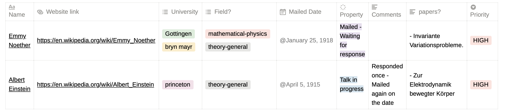

Here is a brainstormed document of some main things to remember when applying for a Physics Ph.D. program. 

###  My search 
I applied mainly to Canadian and German institutions (with a few exceptions). I was looking for more HEP-th positions, particularly in Astroparticle Theory or somewhere on the overlap of formal theory and particle physics. I was also open-minded to adjacent fields. Most of the information I am putting here is from my personal experience during the application period. 

###  Things to keep in mind before you start the search 
- The market seems heavily saturated since COVID hit. Many people have delayed graduation for various reasons - to attend conferences, to finish another experiment, to finish some collaboration, etc. The market seems to be slowly opening up now, and I think for 2023 applications, it should be much better than it was for this round.
	- Why is this relevant? For many places, especially in theory, Professors generally tend to have a finite number of graduate students. 

- A straight-up fact: Some fields have more positions available than others. Experimental positions in any field tend to have more openings than their counterpart (It does make sense, to be honest, you need more people in a lab to do multiple tasks). Mainly, condensed matter seems to be doing very well and has many positions available. Astrophysics seems to have reasonably open positions from what I saw (I was surprised to see quite a few openings during my search). 
	- The point is, if you are looking for something particular position or a position in a field where openings are rare, your search will be much more exhausting than colleagues. As an example of my search, I had approximately a dozen professors I was very excited to apply to in Canada (I feel I was very, very lucky that I got one of my top 3 choices - I mean it, luck does play a very significant role)

	
##  But, where do I look for open positions?  
- [inspire-hep](https://inspirehep.net/jobs?sort=mostrecent&size=25&page=1&rank=PHD) - Even though it is inspire"HEP," you can find job offers for literally most of the fields
- [hyperspace](https://hyperspace.uni-frankfurt.de/) - Particularly for Relativity and Gravitation

There are a few more portals for other parts of Physics (that I didn't apply to, I'll update them as I see them)
##  That's it? 
Absolutely not. A lot of Ph.D. positions are not advertised very well. 

###  Ph.D. programs in Canda 
Most well-known Canadian Universities have a Ph.D. program that requires a Masters before. There are two types of Ph.D. students accepted in Canada. 

1.  **Students who have already secured a Ph.D. advisor**: Some departments in Canada require that you already have secured a Ph.D. advisor, and without that, you cannot enter the Ph.D. program, no matter how good of a profile you have.
	-  McGill, Queens, UVic, Carleton (I am 100% sure you need an advisor telling you to apply to these), McMaster, Manitoba, UOttawa, Guelph,  (I am pretty confident you need a Ph.D. advisor ready to take you on before you apply, so double check please)
2. **Students who have not secured a Ph.D. advisor**: There are other places where I am almost sure that there exists a possibility that you could get in without having secured a supervisor. I repeat, **there exists a possibility** does not mean you should apply without securing a supervisor. It just means that a possibility exists. Your best bet is to contact professors in advance and try to secure an advisor.
	- UofT, Waterloo, Alberta  (I am pretty sure about the possibility of one getting accepted without having secured a Ph.D. advisor, still double check, please)

- "What about the scenario that the Ph.D. advisor is interested in me but has not promised me a Ph.D. position? He has told me to apply." In this scenario, use your judgment. I would apply in most of these scenarios as I am sure my application would receive their attention. I also know that applying to Ph.D. programs in Canada costs a good amount of money and can be financially straining. In case of no financial strain, I highly encourage you to apply. 

###  Ph.D. programs in Germany 
	
In Germany, too, you need an M.Sc. Physics before you can apply for a Ph.D. program. Germany has two types of Ph.D. programs :  

1. **Individual**: As the names suggest, the individual Ph.D. program is when you approach a professor of your liking and join his group from his funding. There is no formal "application portal" using which you apply for such positions. So, how do I find prospective supervisors? 
	1. Google: Universities in Germany
	2. Google: Physics faculty "insert university."
	3. Find the group/s you are interested
	4. Shortlist the professors you like
	5. Look what they are currently doing in terms of research, open their arXiv or inspire-hep 
	6. Prepare all the necessary documents to contact them (CV and transcripts mainly) - In the next section, I have provided a skeleton on contacting prospective supervisors. Feel free to pick up things from there.
2. **Structured**: The other type of Ph.D. is a structured program where you apply formally using an application portal (You can find these, for example, on InspireHEP). Here, funding comes from a grant which is not necessarily your advisor's grant.

##  Contacting prospective supervisors ,/span>
- Contact your prospective professors at least a year in advance. Make a list of professors you would want to contact even before that. I use Notion to organize a significant portion of my life; here is an example, 

	- I would highly recommend making a similar table for the shortlist of programs that you plan to apply to.

- When you contact your prospective professors, make sure you do use your _institutional email address_. Here is a template of how you would want to contact them. 

	
> Dear Prof. Sommerfeld,   
>I am an M.Sc. Physics student in his/her/their last semester at Heidelberg University. I am working on my M.Sc. thesis under the supervision of "insert Prof name" at "insert university." I finished my master's coursework in _insert courses_. My current grade is an _insert grade_. I am also well versed in using/handling _insert coding language / some experimental apparatus / some particular programming package/ software relevant to your field_.    
>My current research has been on _insert two lines of research jargon_ or _insert research topic_. I am also working on _insert if any ongoing parallel project_.   
>I am particularly interested in _insert 2-3 topics that you are interested in, and the prof does too_. _insert one line about the fact that you have seen what work they do in these fields; maybe cite a paper or some article that you read or at least skimmed through thoroughly_. Hence, I wanted to ask if you will be looking for prospective Ph.D. students for _insert semester/term/year_. I have attached my CV below.   Thank you for your time.
> Best regards,   
>Werner Heisenberg

Keep in mind that this is just a template. Please alter it according to your needs. Remove points from the first paragraph that you don't feel are relevant at this point. Remember, this is the first contact with your prospective supervisor. Keep it as brief and up-to-the-point as possible. 

##  Preparing documents for the application 
This step should be started approximately a month **before** you start contacting your prospective supervisors. Here are the documents you will need for most of your applications. I am listing them in descending order of **importance**. The starred documents are the ones you also need when contacting prospective advisors.

###  LOR 
Your letters of recommendation hold much more value than ever imagined. Make sure you have at least two professors who are familiar with your work and one with whom you took a class and were noticed by the professor. By noticing, I do not mean that you necessarily aced their class. You were attentive in their lectures by answering questions, asking good questions, attending office hours, etc. The professor should remember you as a student who was at least diligent and hard working.

###  CV 
Your CV will be crucial in both the stages - Contacting professors and your application. Having the right and concise CV is a matter of art. Do not bold or italicize random things. The whole CV should read as one, with no multiple colors or templates. You can have more than one page, but I would stick to two. **Your CV will be read for approximately 30-45 seconds, so make sure that everything you want the reader to know about you is popping out enough**. The most important principle here is KISS: Keep it simple silly. Don't be over flashy on your CV. A simple classic LaTeX CV will go a long way. I'll soon put an updated CV on my website. I have gone through nearly three different CV templates in the past 5-6 years. I have spent a reasonable amount of time on the contents of my current one, and the template I have used is relatively standard in the field. 

### Transcripts 
When you contact professors and plan to apply, the most important courses and grades should already be on your transcripts. One common mistake I have seen regarding this is: I will take _insert XYZ course_ in two months; let me wait before I ace it to contact my prospective advisor. No, just taking one course will not change their perspective towards you. Make sure you have the most updated transcripts before handing them out. If you got a new grade, request new ones ASAP and add them in **subsequent** documents.

###  Statement of purpose 
Current quick advice? Start early. Very early. You will go through multiple drafts before you reach one you like. I wish you luck if you expect an A-quality SOP in less than a week, but it will be a very daunting task. I will write down a more detailed version of "How to write an SOP for Physics Ph.D." as soon as I get some time on my hands (again, from my perspective. Although I did get some professional help when I applied this time around, so it might have extra transferred gems of wisdom that the professional gave me) 

For your CV and transcripts, make sure you have them prepared well before contacting your prospective advisors.