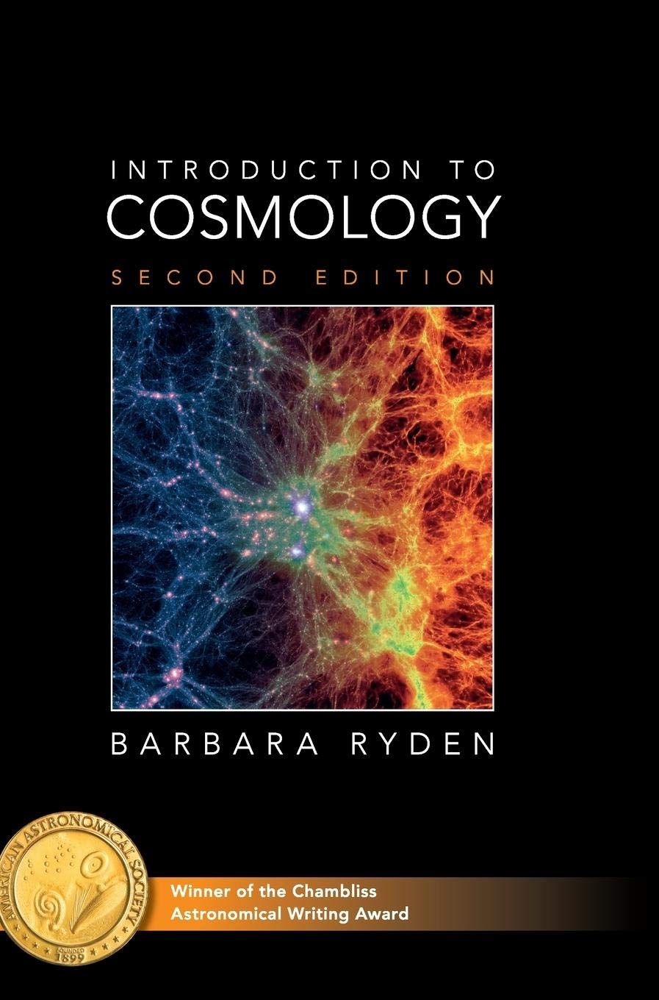

##  Books 

### Introduction to Cosmology - Barbera Ryden 

I came across this book after I was done with my Cosmology coursework. I had seen the book mentioned a few times, but I stuck with Dodelson. This is a better first read if you are new to the subject. All important topics are covered extensively. An excellent linear read! Complements Baumann's lecture notes well.

### Modern Cosmology - S. Dodelson
Expert in the field. His comments, even the smallest ones, are precious. Any topic you don't understand, you can come to this book. The Boltzmann equations (3 and 4) and Inflation (chapter 6) sections are worth a read.

## Freely available online sources

###  Lecture notes - Generally complement well in parallel to a formal course 

- :star2: [Daniel Baumann's lecture notes](http://cosmology.amsterdam/education/cosmology/)   
  No matter what Cosmology course you are doing, these will be there for you. Appendix for General relativity provided, targeted towards the most important results needed for cosmology. Step-by-step computation of results, a lot of diagrams, and boxed paragraphs could be just taken for granted/skipped for the first read. Has lecture "scripts", which are extensive summaries of each lecture. Very useful for being able to summarise what you just learned.
- [David tong's lecture notes ](http://www.damtp.cam.ac.uk/user/tong/cosmo.html)  
  Probably the best lecture notes available in terms of doing everything from scratch. Like all his other notes, these are a masterpiece. No General relativity is required (He does everything Newtonian).  Provides flawless intuition on the subject. Excellent when used as reference notes for a formal course. Being lecture notes, they do not have inline exercises. Emphasising what important results are and what a buildup is can get hard if one does not have previous exposure to the subject.

- [Piatella's lecture notes](https://arxiv.org/pdf/1803.00070.pdf)
-  University of Helsinki : 
    - [Cosmology I](https://www.mv.helsinki.fi/home/hkurkisu/Cosm_I.pdf)
    - [Cosmology II](https://www.mv.helsinki.fi/home/hkurkisu/Cosm_II.pdf)
    - [Cosmological Perturbation theory I](https://www.mv.helsinki.fi/home/hkurkisu/CosPer.pdf)
    - [Cosmological Perturbation theory II](https://www.mv.helsinki.fi/home/hkurkisu/CosPer2.pdf)

### Course websites

- [Amsterdarm cosmology group - Daniel Baumann](http://cosmology.amsterdam/education/cosmology/)
- [Astro/Phys 545 : Cosmology - PSU](http://personal.psu.edu/duj13/ASTRO545/)
- [Hannu Kurki-Suonio : University of Helsinki](https://www.mv.helsinki.fi/home/hkurkisu/)
- Cosmologist.info
  - [Intro to cosmology](https://cosmologist.info/teaching/Cosmology/)
  - [Advanced cosmology/ Early universe](https://cosmologist.info/teaching/EU/)
